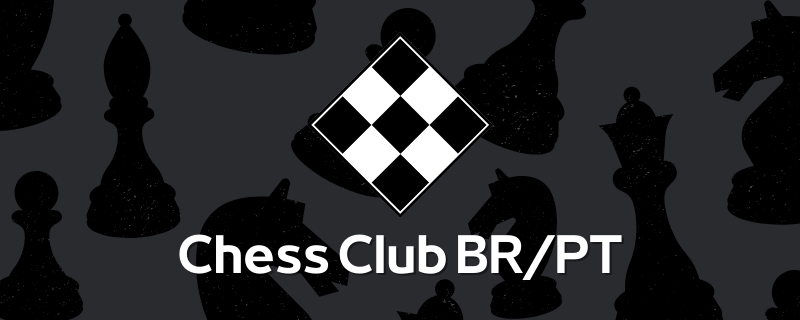

# Fischer

The official Discord bot of [Chess Club BR/PT](https://discord.gg/wdP9Cmcz)

## How to contribute

To contribute to this project, you first need to be part of [this organization](https://github.com/Chess-Club-BR-PT).

This repository uses [trunk-based](https://trunkbaseddevelopment.com/) as branching model. Considering this, here are the necessary steps to submit your code:

1. Clone this repo
2. Create a new branch based on `master`, using some [good practices](https://stackoverflow.com/questions/273695/what-are-some-examples-of-commonly-used-practices-for-naming-git-branches) on its naming, for instance `git checkout -b feat/add-ping-command`
3. Make your changes
4. Push it to the remote with `git push -u origin <your-branch-name>`
5. On [Github](https://github.com/Chess-Club-BR-PT/fischer), open a pull request for this new branch
6. Wait for review
7. After approved, you can merge

## Conventional Commits

In order to get the maximum benefit of [Github automatic release notes](https://docs.github.com/en/repositories/releasing-projects-on-github/automatically-generated-release-notes), we need to follow [some conventions](https://www.conventionalcommits.org/en/v1.0.0/) for pull request titles, which are our commits on `master`.
This repo mainly uses the following commit names:
* `feat:` introduces a new feature to the codebase
* `fix:` patches a bug in your codebase
* `build:` related to CI/CD and other build stuff
* `refactor:` changes some code, without affecting the system behavior
* `test:` related to tests

Some examples:
* `feat: add ping command`
* `fix: use id instead of tag to mention user`
* `build: add dockerfile`
* `refactor: separate ping command logic from command method`
* `test: add unit tests for ping command`

Feel free to use other names, but [keep it simple](https://en.wikipedia.org/wiki/KISS_principle).
